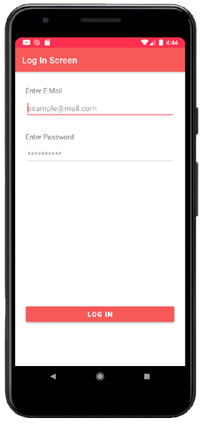
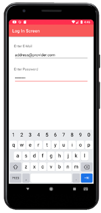
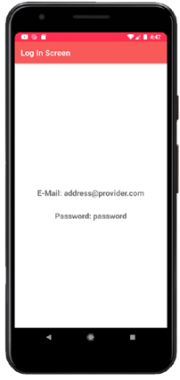

# Android App Library: EditText

## About
Welcome to our Android application. The app is part of the Open Sorce [Android App Library](https://github.com/LukPle/android-app-library.git) 
and adopts all licensing and community guidelines from this project. Please use the link in order to check out the corresponding repository.

The edittext-intent-extra app contains two **EditText** fields for text input. Those values get extracted and transfered to a second screen.
The application serves as an example of these features.

## Features
The setting of the app is a login screen. The user can type in an email and a password for accessing the application.
After clicking the Button for login, the two texts get shown in the next screen.  

## Usage
You can clone the repository into Android Studio by clicking "Get from VCS" in the Welcome Screen or navigating to "File - New - Project from Version Control" inside 
the IDE. When doing so use the URL provided by GitHub. You can run the app on your mobile device or an emulator. Feel free to modify the code or utilize this sample 
for your own project.
